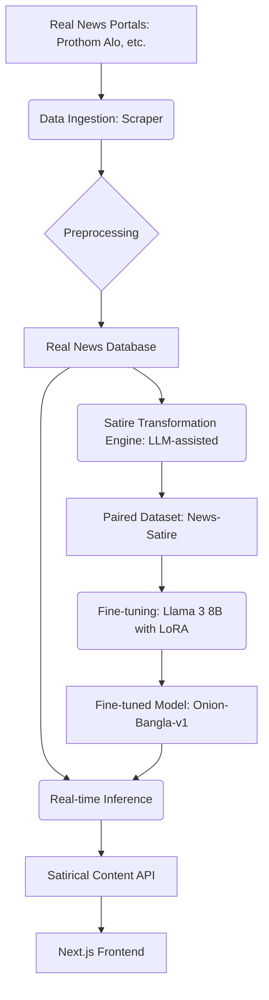

# Bangla Satire Generation Pipeline Architecture

This document describes the end-to-end data and model pipeline for the "Onion Bangla" clone.

## 1. Pipeline Overview
The pipeline consists of four main stages: **Data Ingestion**, **Transformation (Fine-tuning Dataset Creation)**, **Model Fine-tuning**, and **Real-time Inference**.

## 2. Stages Detail

### Stage 1: Data Ingestion (Scraping)
- **Tools:** Python, BeautifulSoup4, Requests/Httpx.
- **Task:** Daily scraping of top 50-100 headlines and summaries from major Bangla news sites.
- **Output:** Structured JSON containing `headline`, `summary`, `category`, and `timestamp`.

### Stage 2: Dataset Creation (The "Satirizer" Pipeline)
- **Problem:** Real-world Bangla satire data is limited.
- **Solution:** Use a "High-End Teacher LLM" (e.g., GPT-4o) to generate initial satirical counterparts for the scraped real news.
- **Human-in-the-Loop:** 10% of generated pairs are reviewed and edited by human editors to ensure cultural nuance and humor quality.
- **Output:** A JSONL file with `{"instruction": "Transform to satire", "input": "[Real News]", "output": "[Satirical News]"}`.

### Stage 3: Fine-tuning (Training)
- **Base Model:** Llama 3 (8B) or similar multilingual transformer.
- **Technique:** QLoRA (4-bit quantization) to reduce VRAM usage.
- **Infrastructure:** RunPod (RTX 4090) or Lambda Labs (A100).
- **Metric:** Loss convergence and qualitative evaluation of 100 test prompts.

### Stage 4: Real-time Inference & Serving
- **Backend:** FastAPI.
- **Workflow:**
    1. Scraper fetches "Breaking News".
    2. Fine-tuned model generates 3-5 satirical versions.
    3. Backend caches the best version.
    4. Frontend fetches via `GET /api/news`.

## 3. Key Components
- **Vector DB (Optional):** To ensure topicality by retrieving "similar historical satire" as context for the model.
- **Prompt Engineering:** Systematic prompts that enforce "Onion-style" (e.g., straight-faced reporting of absurd scenarios).
- **Safety Filter:** Basic keyword filtering to avoid sensitive political or religious controversy that might violate local laws or ethics.
